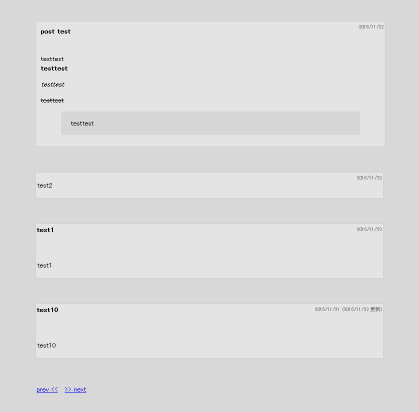

# WordPress-test-theme

> ごく簡素なページをWordPressで生成するためのテーマの例

## 使い方

1. `<wordpress root directory>/wp-contents/themes/<適当なディレクトリ名>/` の中にこれらのファイルを放り込む
2. WordPressの管理画面上でテーマを選択

## その他

* このテーマではログインページへのリンクも省いてしまっているため、新たな記事の投稿に際しては予めログインページや投稿ページURLをメモしておいてからアクセスしてください

